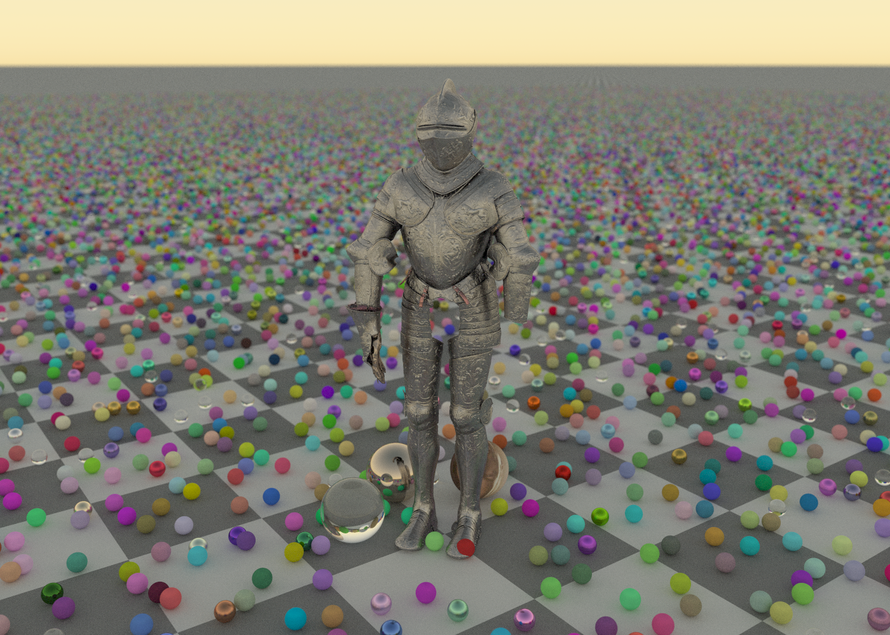
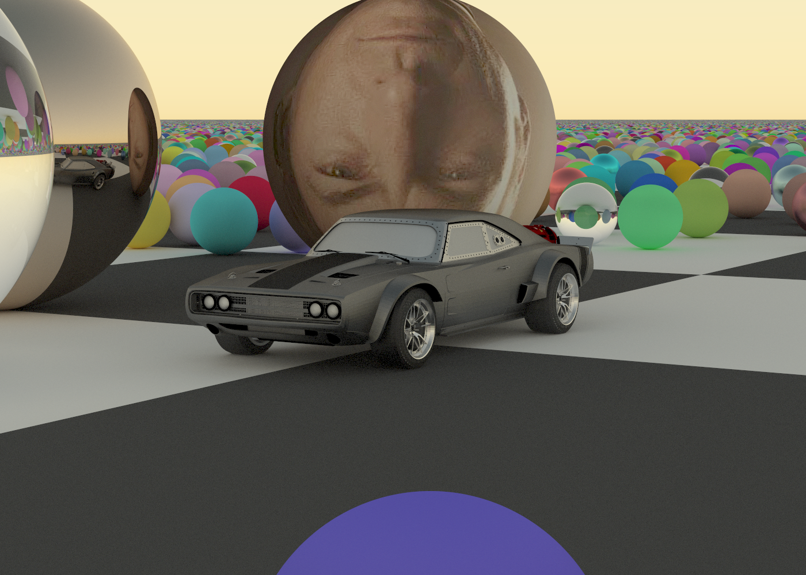

# rt

`rt` is a reasonably physical ray tracer I'm writing in Rust. It initially followed Peter Shirley's [Ray Tracing in One Weekend](https://raytracing.github.io/books/RayTracingInOneWeekend.html) series, and though it still shares some of the series' core architecture, it has grown and changed significantly since then.

Some of its features include:

- Live rendering with a preview window
- Meshes and mesh importing from [.gltf](https://github.com/gltf-rs/gltf) and [.obj](https://github.com/Twinklebear/tobj) files
- Texture and metallic roughness mapping for meshes
- A fancier [sky model](https://github.com/phoekz/hw-skymodel)
- Frosted/fuzzy glass materials
- A bounding volume hierarchy I borrowed from [bvh](https://github.com/svenstaro/bvh) for faster ray intersection detection
- Enough parallelism using [Rayon](https://github.com/rayon-rs/rayon) to turn my laptop into a heater

This is still very much a work in progress (see [`TODO.md`](./TODO.md)), and doesn't use the GPU at all.

## Live Rendering

Supports a live progressive render preview using [winit](https://github.com/rust-windowing/winit) and [pixels](https://github.com/parasyte/pixels) so you can monitor your render's progress.

https://github.com/user-attachments/assets/73a87dbe-7503-44db-82e9-313ffc7b4dbb

## Sample Renders

### Giant Saul Goodman & Dodge Charger

### RTIOW Cover Image

## 3D Assets

Armor render based on ["The Parade Armour of King Erik XIV of Sweden"](https://sketchfab.com/3d-models/the-parade-armour-of-king-erik-xiv-of-sweden-bd189bba7d9e4924b12826a6d68200d9) by [The Royal Armoury (Livrustkammaren)](https://sketchfab.com/TheRoyalArmoury) licensed under [CC-BY-4.0](http://creativecommons.org/licenses/by/4.0/)

Car render based on ["F&F 8 | Dominic Toretto's ICE DODGE CHARGER"](https://sketchfab.com/3d-models/ff-8-dominic-torettos-ice-dodge-charger-ffb8bead6c2642bbbd02a71b0b19e5b9) by [kevin (ケビン)](https://sketchfab.com/sohyalebret) licensed under [CC-BY-4.0](http://creativecommons.org/licenses/by/4.0/)