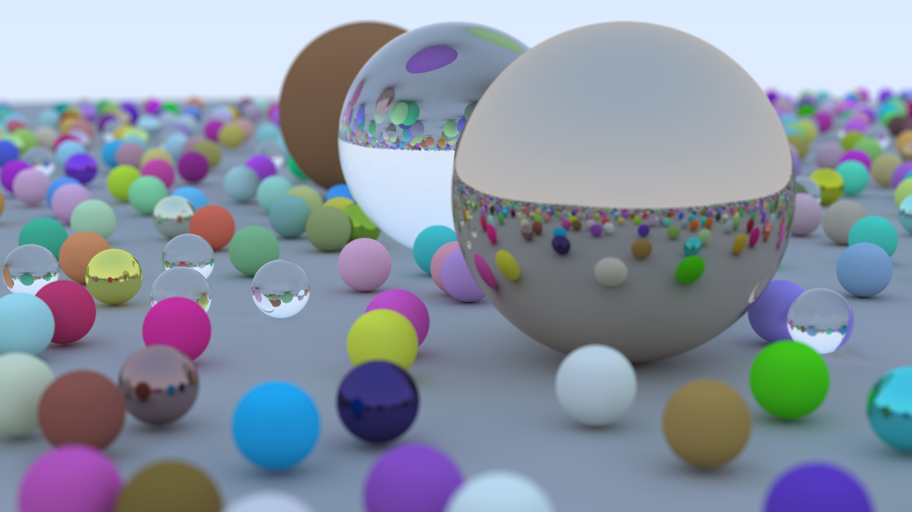

# rt

Raytracer made in Rust following Peter Shirley's [Ray Tracing in One Weekend](https://raytracing.github.io/books/RayTracingInOneWeekend.html).
Parallelized using [Rayon](https://github.com/rayon-rs/rayon).

## Final Render

Renders a 1920x1080 image with 10 bounces per ray and 1000 rays per pixel in 1hr 17mins on a 16-inch 2021 M1 Macbook Pro.

